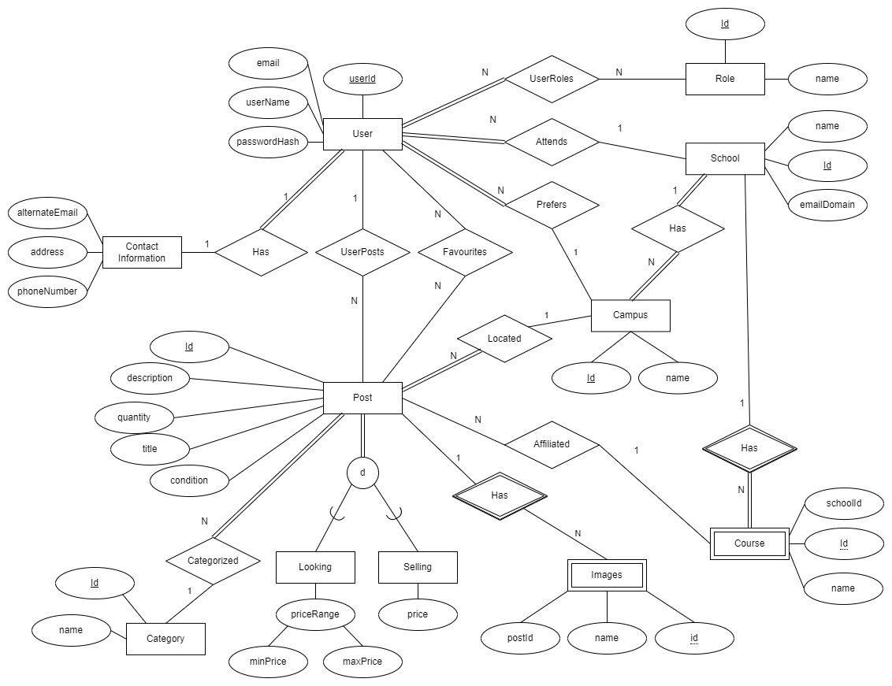

# Database Design

## Requirements

- The app requires a user account. Each user signs up under their school using their school email. The school mail domain and email must match.
    - Un-authenticated users can see posts but posters contact information is hidden?
    - Each school has a name and email domain.
- Regular users have the "User" role but there is also an "Admin" role. Accounts can have many roles. The admin has control over all the schools, users, and posts.
- Users can make numerous posts for items they wish to advertise. Users can only edit their own postings.
    - A may have an associated course if applicable (i.e. textbooks, tutor sevices, etc)
    - Posts can have pictures (with max), title, description...
    - Posts can have many different categories other than a course for more generalized things
    - Users can search posts by school, course, category, or keywords. 
- Users can "like" other posts and see a list of their favourites for later.

